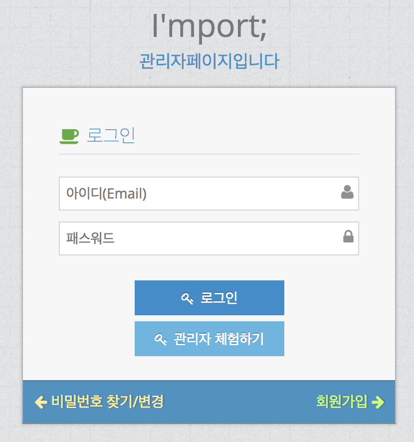
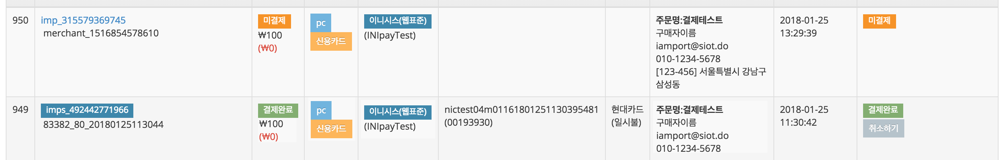

# Iamport ( 아임포트 : [http://www.iamport.kr/](http://www.iamport.kr/) )

## 아임포트란?
기존의 제한적인 API를 제공하던 결제 모듈 업체의 틀을 깬, 
굉장히 많은 언어의 라이브러리를 지원 하게 된 결제 모듈 서비스

**- 금액 결제 프로세스 중** 웹서버와 PG사 간의 중간 역할을 함

> 고객 <-> 웹서버(ex:쇼핑몰) <- `여기` -> PG사

결제 카드정보 오류, PG사 점검 등의 문제로 인한 오류와 아임포트는 상관없으며, 
해당 문제는 응대 하지 않음.

## 관리자 페이지 ( [https://admin.iamport.kr](https://admin.iamport.kr) )

> 샘플 소스를 통해 결제 테스트를 진행 할 수 있다. 
가맹점 식별 코드를 'iamport'로 셋팅 후 결제를 시도할 경우 
테스트 결제가 되며 관리자 페이지의 관리자 체험하기 버튼을 통해 로그인 하여 확인 할 수 있다

> 결제 리스트 확인과 결제 취소를 할 수 있다.

**` 가장 중요한!!! 테스트 모드의 결제 취소 건은 당일 자정에 일괄 처리 된다.`**

